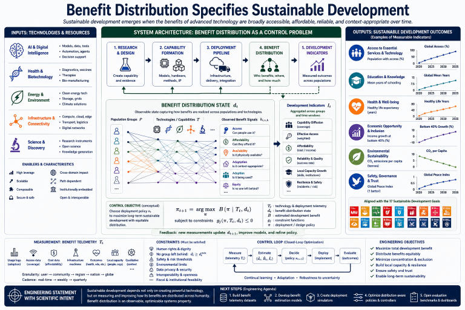

# benefits-distribution

Engineering benefit distribution as an observable system state through telemetry, estimation, simulation, and distribution-aware deployment.



## Motivation

This repository explores benefit distribution as a measurable systems property for sustainable development.

## Planned notebooks

- 00_context.ipynb
- 07_state_variable.ipynb
- 13_benefit_telemetry.ipynb
- 17_distribution_graphs.ipynb
- 23_benefit_estimation.ipynb
- 29_deployment_simulation.ipynb
- 37_distribution_aware_controllers.ipynb
- 43_benchmarking.ipynb

## Repository layout

```
src/
notebooks/
figures/
results/
data/
docs/
```
